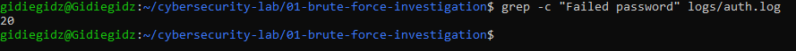
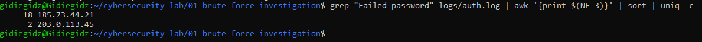
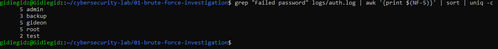
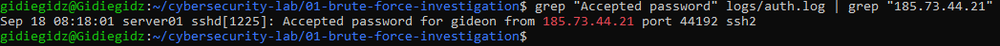

# SSH Brute-Force Attack Investigation

## Overview

This project is a simulated investigation of suspicious SSH login activity on a Linux server.

I analyzed an authentication log to identify failed login attempts, source IP addresses, targeted accounts, and successful authentication attempts.

The investigation was performed using Ubuntu through WSL and Linux command-line tools.

## Investigation Summary

The log contained:

- 20 failed SSH login attempts
- 18 failed attempts from `185.73.44.21`
- 2 failed attempts from `203.0.113.45`
- 5 targeted accounts: `admin`, `root`, `gideon`, `backup`, and `test`
- A successful login to `gideon` from `185.73.44.21`
- The successful login occurred 46 seconds after the last failed attempt against `gideon`

The successful login does not prove that the account was compromised. Additional logs and system activity would be needed to determine whether the login was authorized.

## Tools Used

- Ubuntu Linux
- WSL
- grep
- awk
- sort
- uniq
- head
- tail
- wc

## Investigation Process

I used Linux command-line tools to:

1. Count failed SSH authentication attempts.
2. Identify the source IP addresses.
3. Identify the accounts being targeted.
4. Check for successful authentication from the suspicious IP.
5. Build a timeline of the activity.
6. Identify additional evidence that would be needed for further investigation.

## Key Finding

The main finding was repeated failed authentication activity from `185.73.44.21`, followed by a successful login to the `gideon` account from the same IP.

This activity would require further investigation in a real environment to determine whether the login was authorized.

## Environment

- Ubuntu Linux
- Windows Subsystem for Linux (WSL)
- Simulated SSH authentication log

No real credentials, production systems, or private network data were used.

## Detailed Investigation

The full investigation, including the commands used, results, timeline, findings, remediation considerations, and limitations is available here:

[Investigation Report](analysis/investigation.md)

## Screenshots

### 1. Failed Authentication Count

### 2. Source IP Analysis

### 3. Targeted Accounts

### 4. Successful Authentication

